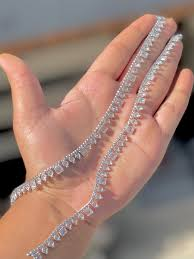

<html lang="en">
<head>
    <meta charset="UTF-8">
    <meta name="viewport" content="width=device-width, initial-scale=1.0">
    <title>For Manya</title>
    
</head>
<body>

    

    

        

            
        

        <h1>To my pasandida Mahila...</h1>
        <button class="btn" onclick="nextPage(2)">Open ❤️</button>
    

    

        <h1>For the smiles you bring...</h1>
        

            
            
        

        
Just a few memories of little things...

        <button class="btn" onclick="nextPage(3)">Next 🎁</button>
    

    

        <h1>And the memories we make...</h1>
        

            
            
        

        
I hope you liked these!

        <button class="btn" onclick="nextPage(4)">I have a question...</button>
    

    

        <h1>Manya, Will you be my valentine and promise to be with me forever ??</h1>
        
        

            <button class="btn" onclick="nextPage(5)">YES</button>
            <button class="btn" id="noBtn" onclick="rejectLove()">NO</button>
        

    

    

        

            

                Thank you Manya for accepting this.I want you to know that you are the best thing that could happen to me in my life. You're the reason I could make it this far, and I promise to always be there for you. Ik that I've made some mistakes in the past 
                but I promise that everything will become better.   
                Thank you for being the peace of my life. I have a big favour to ask you. If you're free for the next 70 years or so, I want to ask you to be my lover and stay with me forever.
                I promise you to make your life the best.
            

            <h3>Love, Rajbir Singh</h3>
        

    

    
</body>
</html>
